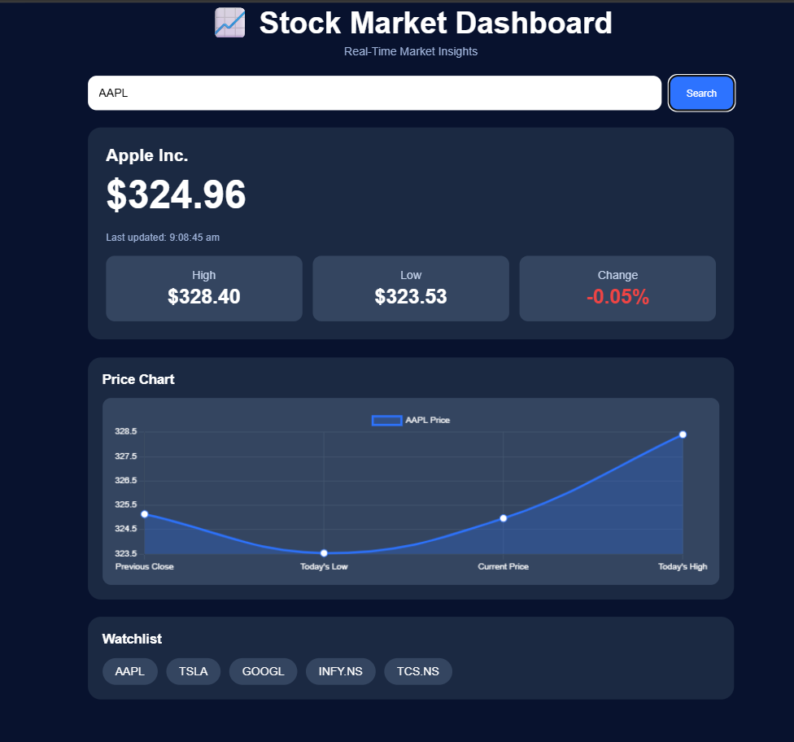
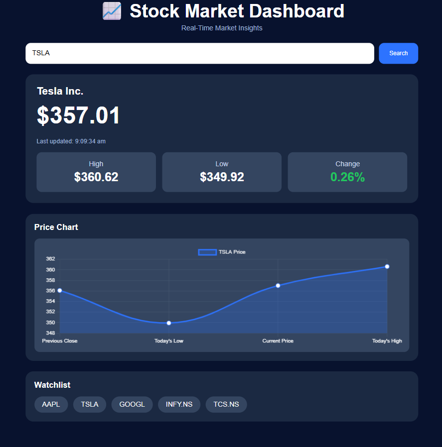
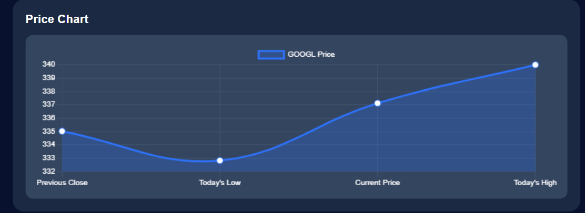
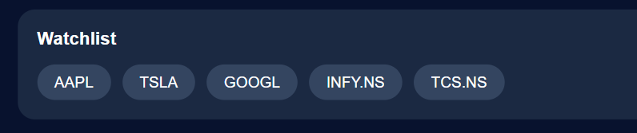

# 📈 Stock Market Dashboard

A real-time Stock Market Dashboard built using **HTML, CSS, JavaScript, Chart.js, and the Finnhub REST API**. The application displays live stock prices, market trends, and interactive charts with automatic 30-second refresh.

## 🚀 Features

- 🔍 Live stock search (AAPL, TSLA, GOOGL, INFY.NS, TCS.NS)
- 📊 Interactive Chart.js visualization
- 📈 Current Price, High, Low, and Percentage Change
- ⭐ Clickable Watchlist
- ⏱️ Automatic 30-second data refresh
- 🕒 Last Updated timestamp
- 📱 Responsive dark-themed UI
- 🛡️ Secure API key management using `config.js` and `.gitignore`

## 🛠️ Tech Stack

- HTML5
- CSS3
- JavaScript (ES6)
- Chart.js
- Finnhub REST API
- Git & GitHub

## 📸 Project Screenshots

### Apple Dashboard



### Tesla Dashboard



### Interactive Price Chart



### Clickable Watchlist



## 📂 Project Structure

```text
Stock-Market-Dashboard/
├── screenshots/
├── config.js
├── .gitignore
├── index.html
├── style.css
├── script.js
└── README.md
```

## ⚙️ How to Run

1. Clone this repository.
2. Create a `config.js` file.
3. Add your Finnhub API key:

```javascript
const apiKey = "YOUR_FINNHUB_API_KEY";
```

4. Open `index.html` using **Live Server** in VS Code.

## 📚 What I Learned

- REST API integration using `fetch()`
- Asynchronous programming with `async/await`
- DOM manipulation
- Chart.js integration
- Real-time updates using `setInterval()`
- Responsive web design
- API key security using `.gitignore`